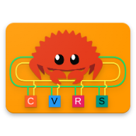

# canviewer-rs
A Realtime CAN network viewer with DBC support

<p align="center">

</p>

## Checklist (What works and what doesn't)

- [x] DBC loading
- [x] SocketCAN support
- [ ] Historical graphing of CAN data
- [x] CAN Frame viewer
- [ ] Appimage generation
- [ ] Editing of DBC files
- [ ] Showing signal sender and receivers as a node graph
- [ ] Signal / message searching

## Usage
```
./canviewer <SOCKETCAN IFACE> <DBC FILE>
```

EG:
```
./canviewer can0 my_can_dbc.dbc
```